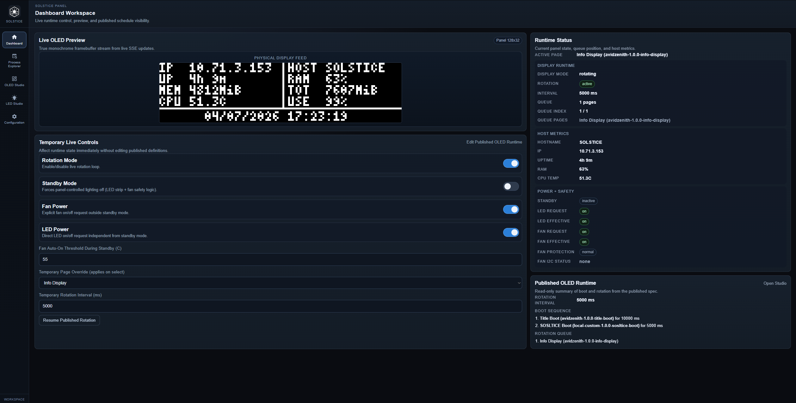
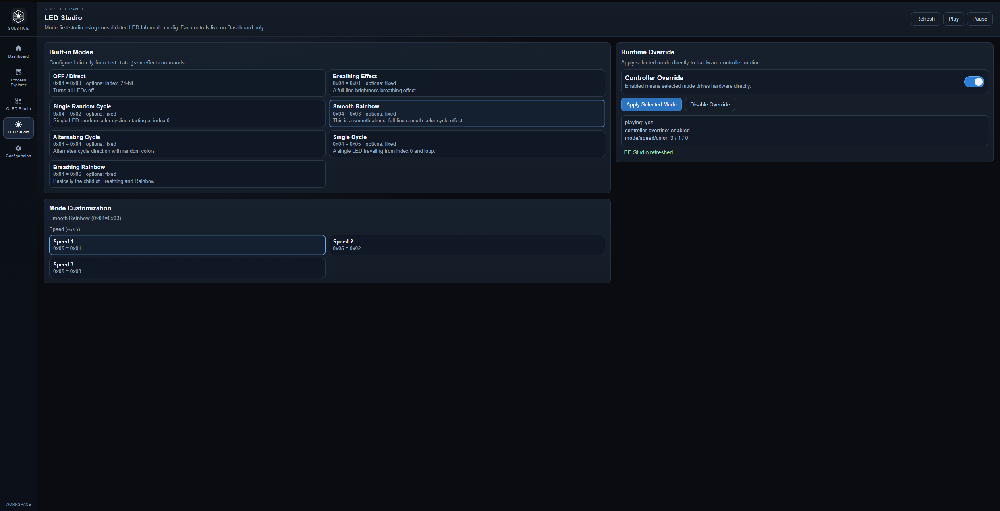
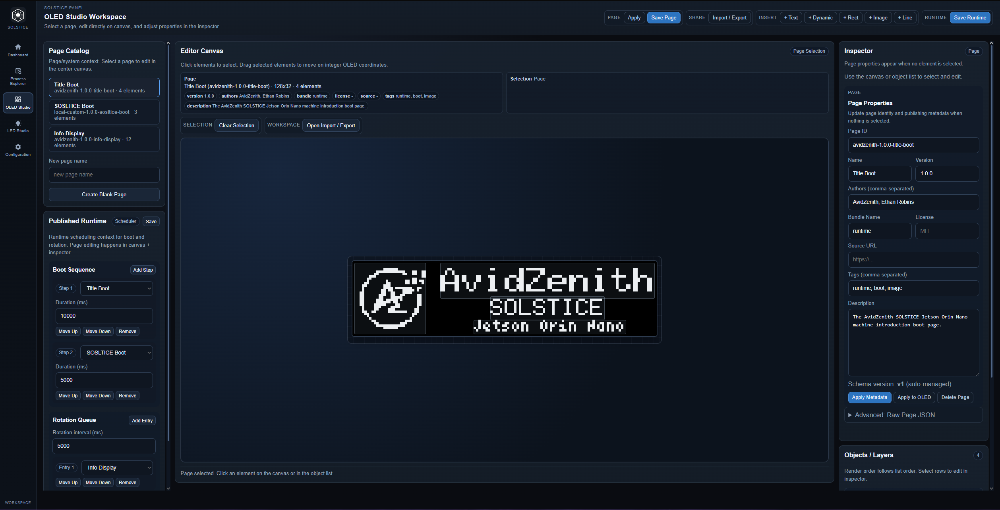
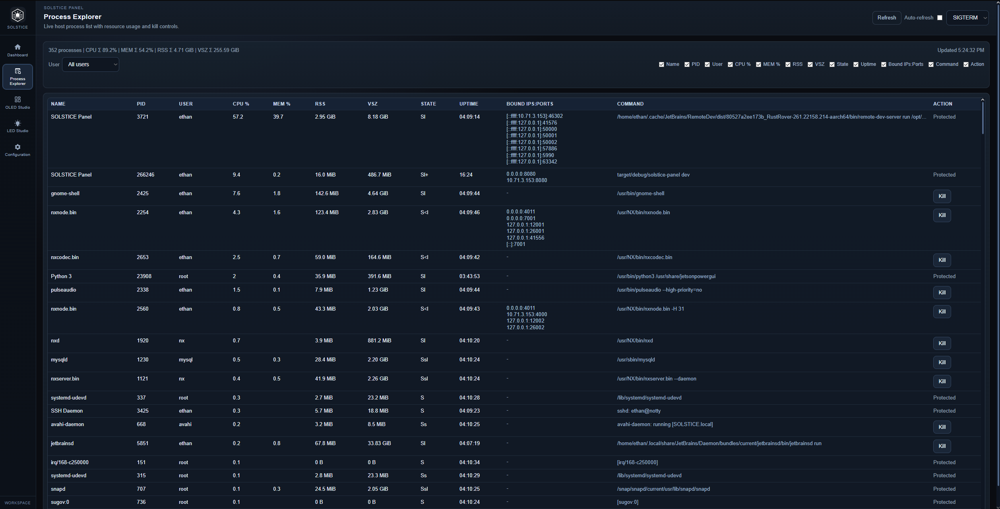
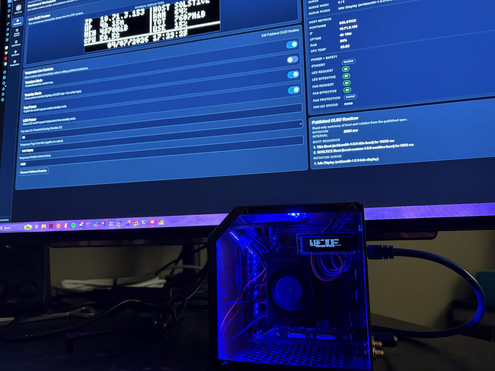

# SOLSTICE Panel

SOLSTICE Panel is a Rust-based local control UI for OLED + LED panel hardware on Linux ARM64 systems.
It is built for embedded hosts like Jetson Orin Nano and provides:

- Live OLED dashboard preview and runtime controls
- LED Studio with built-in effects and mode-specific customization
- Fan + LED power controls with standby safety behavior
- OLED page studio (catalog, runtime scheduling, visual editor)
- Process Explorer (GUI process list + guarded kill actions)
- Configuration GUI for `solstice-panel.toml`

## Hardware Profile

This project is built and configured for:

- Yahboom MINI CUBE NANO Case
- The accessories included with that kit (OLED/LED/fan and the YB-EJV01-V1.0 Jetson header pin extension bridge board)

Hardware reference links:

- Official product page: [https://category.yahboom.net/products/cube_nano](https://category.yahboom.net/products/cube_nano)
- Case GitHub repo: [https://github.com/YahboomTechnology/Jetson-CUBE-case](https://github.com/YahboomTechnology/Jetson-CUBE-case)
- Amazon listing: [https://www.amazon.com/dp/B0CD71X8SV?ref=ppx_yo2ov_dt_b_fed_asin_title](https://www.amazon.com/dp/B0CD71X8SV?ref=ppx_yo2ov_dt_b_fed_asin_title)

If your hardware differs, review and adjust:

- `config/solstice-panel.toml` (I2C path, addresses, LED count, fan threshold)

## Images






## Target Platform

- NVIDIA Jetson Orin Nano
- JetPack (ARM64)
- Linux with I2C device access (example used by this project: `/dev/i2c-7`)

## Quick Install (Prebuilt Binary)

```bash
cd /tmp
wget https://github.com/Ether0p12348/SOLSTICE-Panel/releases/download/v1.0.0/solstice-panel-aarch64-1.0.0.tar.gz
tar -xzf solstice-panel-aarch64-1.0.0.tar.gz
sudo mkdir -p /opt/solstice-panel
sudo rsync -a --delete solstice-panel-aarch64-1.0.0/ /opt/solstice-panel/
cd /opt/solstice-panel
./solstice-panel
```

The release bundle should include:

- `solstice-panel` binary
- `config/` directory
- `assets/` directory

## Quick Install (From Source)

### 1. Install system dependencies

```bash
sudo apt update
sudo apt install -y build-essential pkg-config curl git i2c-tools
```

### 2. Install Rust (if not installed)

```bash
curl https://sh.rustup.rs -sSf | sh -s -- -y
source "$HOME/.cargo/env"
rustc --version
cargo --version
```

### 3. Clone and build

```bash
git clone https://github.com/Ether0p12348/SOLSTICE-Panel.git
cd solstice-panel
cargo build --release
```

## Running As A Service (systemd)

`solstice-panel` loads config and serves assets via relative paths, so keep a stable working directory (example: `/opt/solstice-panel`).

### 1. Install project to `/opt/solstice-panel`

```bash
sudo mkdir -p /opt/solstice-panel
sudo rsync -a --delete ./ /opt/solstice-panel/
```

### 2. Create systemd unit

Create `/etc/systemd/system/solstice-panel.service`:

```ini
[Unit]
Description=SOLSTICE Panel
After=network-online.target
Wants=network-online.target

[Service]
Type=simple
User=<user>
WorkingDirectory=/opt/solstice-panel
ExecStart=/opt/solstice-panel/target/release/solstice-panel
Restart=on-failure
RestartSec=2
Environment=RUST_LOG=info

[Install]
WantedBy=multi-user.target
```

### 3. Enable and start

```bash
sudo systemctl daemon-reload
sudo systemctl enable --now solstice-panel
sudo systemctl status solstice-panel
```

### 4. Logs

```bash
journalctl -u solstice-panel -f
```

## I2C Access Notes

- Confirm the expected I2C bus exists (`/dev/i2c-7` by default in config).
- If running as non-root, ensure the service user has permission to access I2C devices.
- You can validate bus visibility with:

```bash
ls -l /dev/i2c-*
i2cdetect -y 7
```

## Configuration

Main config file:

- `config/solstice-panel.toml`

Current sections:

- `[display]` OLED settings (enable, size, i2c path/address)
- `[runtime]` OLED refresh timing
- `[web]` bind address/port
- `[led]` LED runtime settings (enable, default effect, hardware count)
- `[fan]` fan safety threshold

You can edit config from:

- Web UI: **Configuration** workspace
- File directly: `config/solstice-panel.toml`

## Feature Overview

### Dashboard

- Live OLED preview
- Rotation enable/disable
- Standby mode toggle
- Fan power toggle
- LED power toggle
- Fan auto-on threshold control
- Published OLED runtime summary

### LED Studio

- Built-in mode buttons from `config/led-lab.json`
- Mode customization driven by capability flags:
  - `can_speed`
  - `can_color_preset`
  - `can_index`
  - `can_color_24`
- Direct pixel programming for supported modes

### OLED Studio

- Page catalog management
- Element editing (text/dynamic/rect/image/line)
- Runtime boot sequence + rotation queue management
- Import/export page JSON

### Process Explorer

- Live process table (user, pid, cpu/mem/rss/vsz, state, runtime)
- Bound `IP:port` endpoint visibility
- User filtering and column visibility toggles
- Kill actions with confirmation and protected-process safeguards

## API Summary

Primary endpoints include:

- `GET /api/health`
- `GET /api/events`
- `GET /api/processes`
- `GET /api/metrics`
- `GET/POST /api/system/config/*`
- `GET/POST /api/studio/*`
- `GET/POST /api/led/*`
- `GET/POST /api/power/*`

See `src/web/routes.rs` for the complete list.

## Contributing

Contributions are welcome.

Before opening a PR, read and follow:

- [`LICENSE.md`](./LICENSE.md)

If your contribution changes behavior, include:

- A short rationale
- Validation steps
- UI screenshots (if frontend changes)

## Troubleshooting

- Parse error on startup: validate `config/solstice-panel.toml` sections/keys.
- Blank UI styles/icons: verify `assets/` is present and the process working directory is project root.
- Hardware not responding: verify I2C bus path/address values and permissions.

## License

See [`LICENSE.md`](./LICENSE.md).
